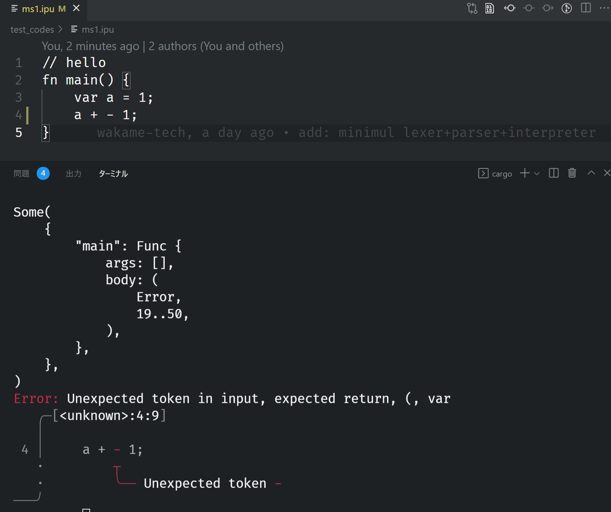
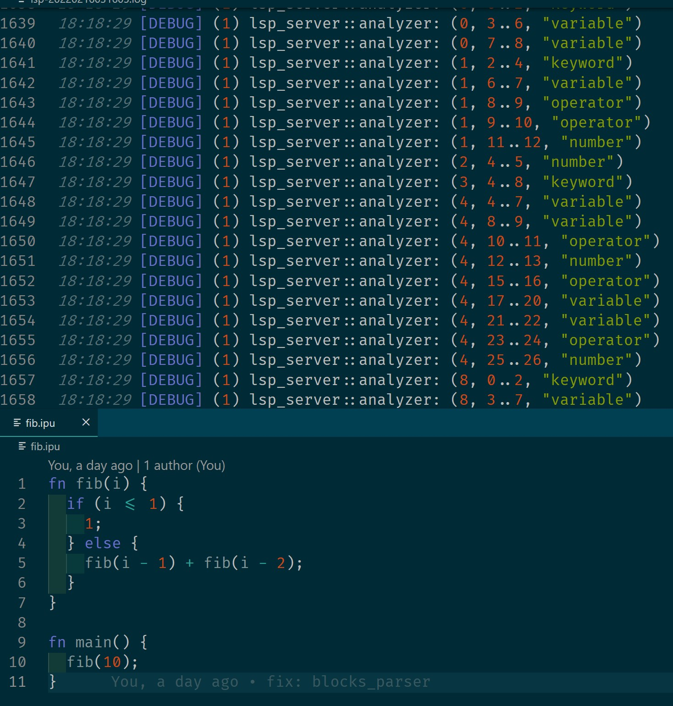
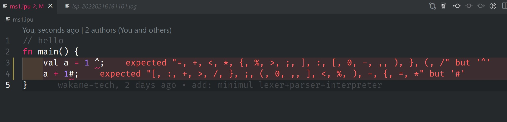

# lsp-prac
- [x] chumsky example
- [x] lex toy lang

- [x] parse toy lang
- [x] LSP setup

- [x] support Semantic Tokens

- [x] support Diagnostics for lex errs
  - TODO: refresh when file closed

